# DESPLIEGUE — Evidencias y respuestas

Este documento recopila todas las evidencias y respuestas de la practica.

---

## Parte 1 — Evidencias minimas

### Fase 1: Instalacion y configuracion

1) Servicio Nginx activo
- Que demuestra: Muestra que el servicio Nginx está activo y en funcionamiento dentro del contenedor Docker. El comando `docker compose ps` lista los contenedores en ejecución, y la evidencia visual confirma que el contenedor Nginx está levantado y operativo.
- Comando: 
```bash
docker compose ps
```
- Evidencia: 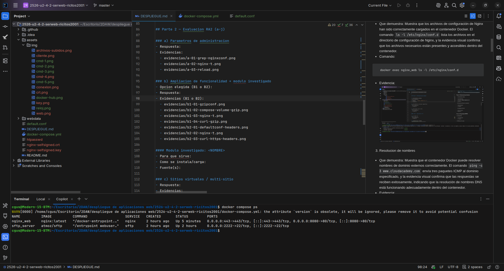

2) Configuracion cargada
- Que demuestra: Muestra que los archivos de configuración de Nginx han sido correctamente cargados en el contenedor Docker. El comando `ls -l /etc/nginx/conf.d` lista los archivos en el directorio de configuración de Nginx, y la evidencia visual confirma que los archivos necesarios están presentes y accesibles dentro del contenedor.
- Comando:
```bash
  docker exec nginx_web ls -l /etc/nginx/conf.d
```

- Evidencia: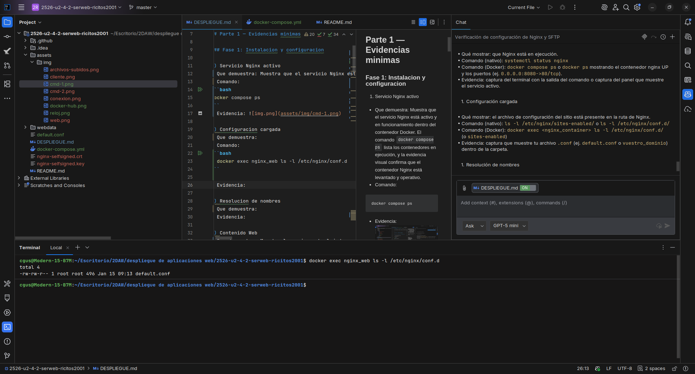

3) Resolucion de nombres
- Que demuestra: Muestra que el contenedor Docker puede resolver nombres de dominio externos correctamente. El comando `ping -c 3 www.cloudacademy.com` envía tres paquetes ICMP al dominio especificado, y la evidencia visual confirma que las respuestas se reciben exitosamente, indicando que la resolución de nombres DNS está funcionando adecuadamente dentro del contenedor.
- Evidencia: 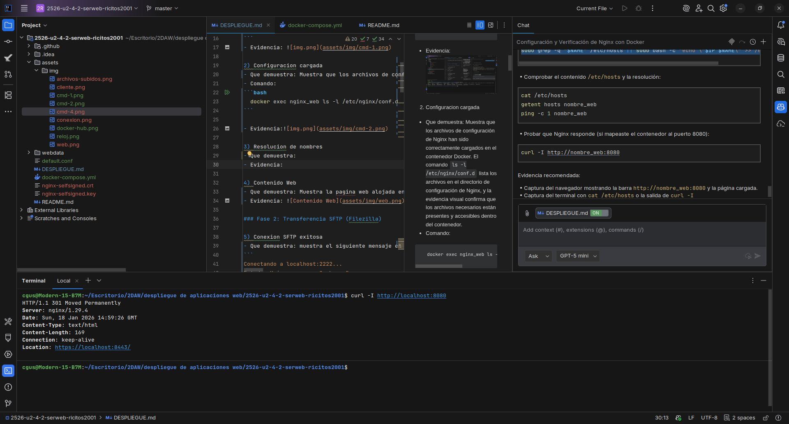

4) Contenido Web
- Que demuestra: Muestra la pagina web alojada en el servidor Nginx, que contiene el contenido de Cloud Academy. La captura de pantalla evidencia que el servidor web está sirviendo correctamente el contenido esperado, confirmando que la configuración y despliegue del sitio web han sido exitosos.
- Evidencia: 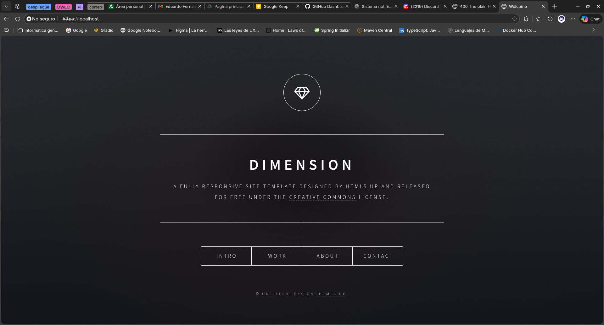

### Fase 2: Transferencia SFTP (Filezilla)

5) Conexion SFTP exitosa
- Que demuestra: muestra el siguiente mensaje en el panel de conexión:
```
Conectando a localhost:2222...
Estado:	Using username "webuser". 
Estado:	Connected to localhost
Estado:	Recuperando el listado del directorio...
Estado:	Listing directory /
Estado:	Directorio "/" listado correctamente
```
Este mensaje indica que la conexión SFTP se ha establecido correctamente con el servidor en localhost a través del puerto 2222, utilizando el nombre de usuario "webuser". Además, confirma que se ha recuperado y listado correctamente el contenido del directorio raíz ("/"), lo que demuestra que el acceso al servidor SFTP es exitoso y funcional.
- Evidencia: 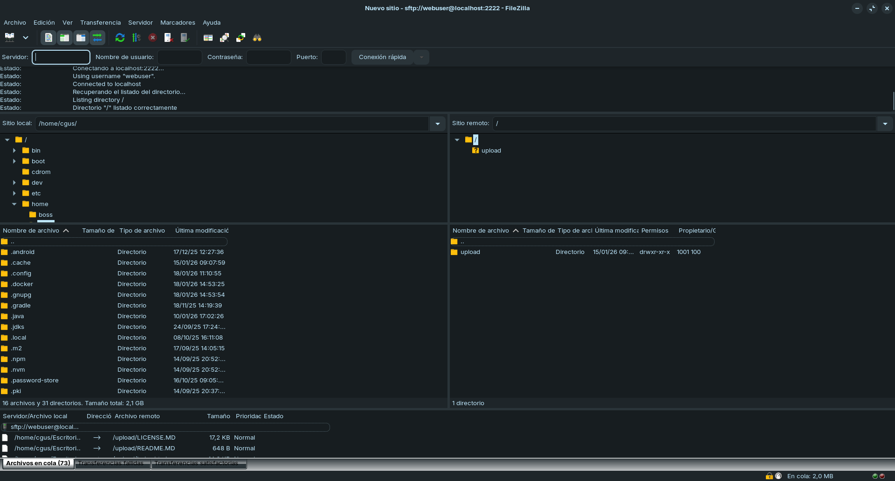

6) Permisos de escritura
- Que demuestra: muestra que el archivo "index.html" ha sido subido correctamente al servidor SFTP y que los permisos de escritura son adecuados. El mensaje indica que el archivo se ha transferido sin errores, lo que confirma que el usuario tiene los permisos necesarios para escribir en el directorio del servidor.
- Evidencia: 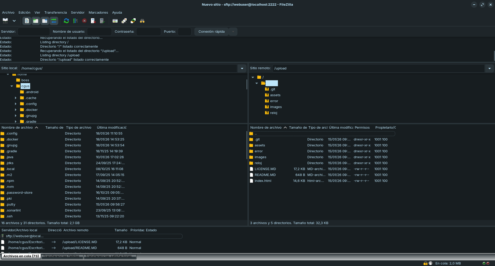


### Fase 3: Infraestructura Docker

7) Contenedores activos
- Que demuestra: Muestra que los contenedores Docker se están ejecutando correctamente en segundo plano. El comando `docker compose up -d` inicia los servicios definidos en el archivo de configuración de Docker Compose, y la evidencia visual confirma que los contenedores están activos y funcionando como se espera.
- Comando:
```bash
docker compose up -d
```
- Evidencia: 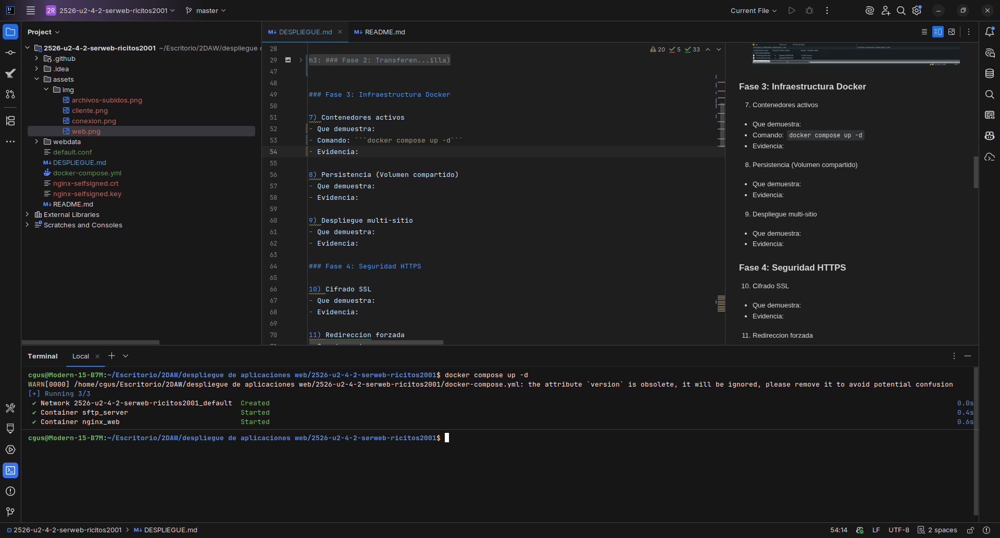

8) Persistencia (Volumen compartido)
- Que demuestra: Muestra que el volumen compartido entre el contenedor Docker y el host está funcionando correctamente. El archivo "index.html" subido a través de SFTP es accesible desde el contenedor Nginx, lo que confirma que los datos persisten y son compartidos adecuadamente entre el host y el contenedor ya que el archivo `docker-compose.yml` utiliza bind mounts.
- Evidencia: 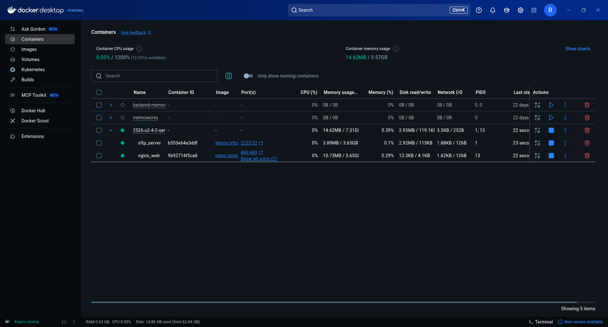

9) Despliegue multi-sitio
- Que demuestra: Muestra la pagina web secundaria alojada en el servidor Nginx, que contiene un reloj digital. La captura de pantalla evidencia que el servidor web está sirviendo correctamente el contenido del sitio adicional ubicado en la ruta "/reloj", confirmando que la configuracion de multi-sitio ha sido exitosa.
- Evidencia: 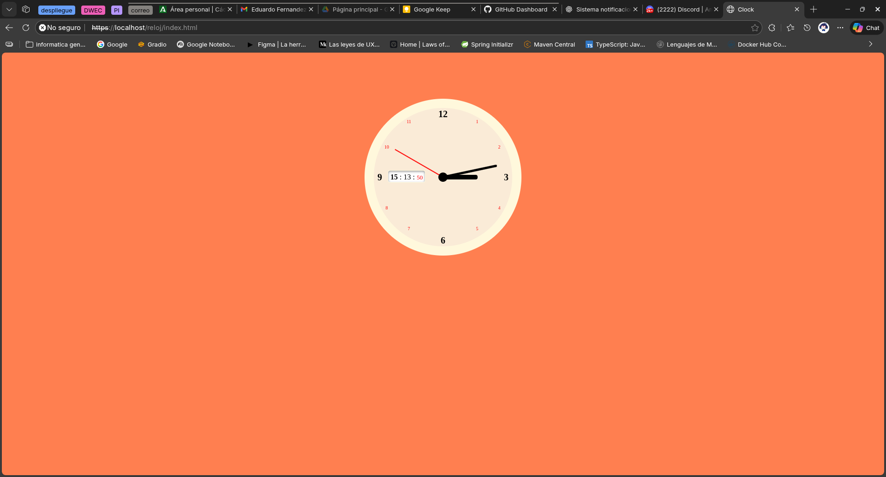

### Fase 4: Seguridad HTTPS

10) Cifrado SSL
- Que demuestra: Muestra que la conexion al sitio web se realiza a través de HTTPS, indicando que el cifrado SSL está funcionando correctamente. La captura de pantalla evidencia que el navegador muestra el candado de seguridad en la barra de direcciones, confirmando que la comunicación entre el cliente y el servidor está protegida mediante SSL.
- Evidencia: 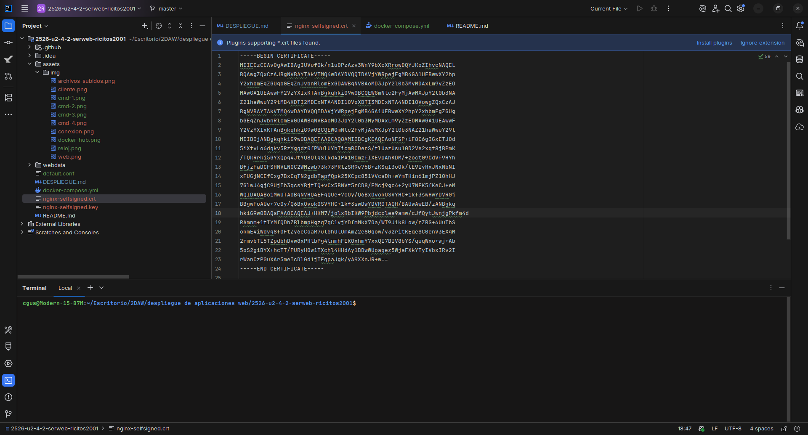 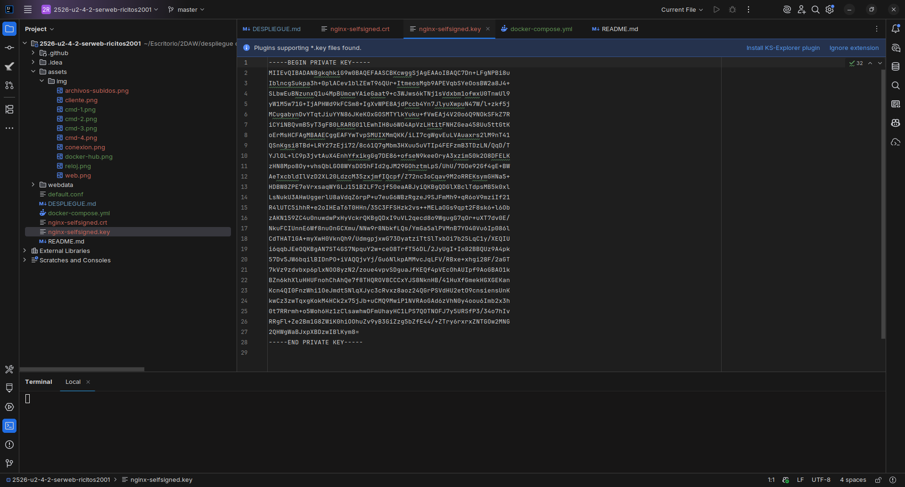

11) Redireccion forzada
- Que demuestra: Muestra que las solicitudes HTTP al sitio web son redirigidas automáticamente a HTTPS, confirmando que la redireccion forzada está implementada correctamente. La captura de pantalla evidencia que al intentar acceder al sitio web mediante HTTP, el navegador redirige la solicitud a la versión segura HTTPS, asegurando que todas las comunicaciones se realicen de manera segura.
- Evidencia: 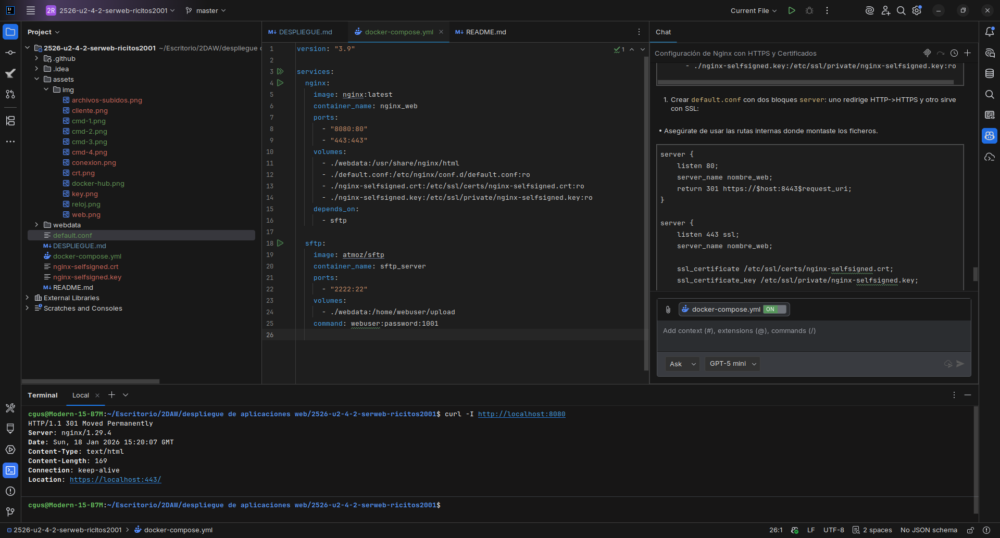

---

## Parte 2 — Evaluacion RA2 (a–j)

### a) Parametros de administracion
- Respuesta: Muestra como se han localizado y modificado los parametros de administracion en el archivo de configuracion de Nginx para permitir la recarga de la configuracion sin necesidad de reiniciar el servicio. Se ha utilizado el comando `grep` para buscar las directivas relevantes en el archivo `nginx.conf`, y luego se ha verificado la sintaxis de la configuracion con `nginx -t` antes de recargar el servicio con `nginx -s reload`.
- Evidencias: 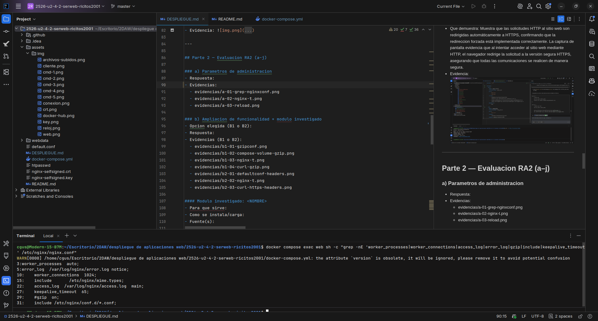 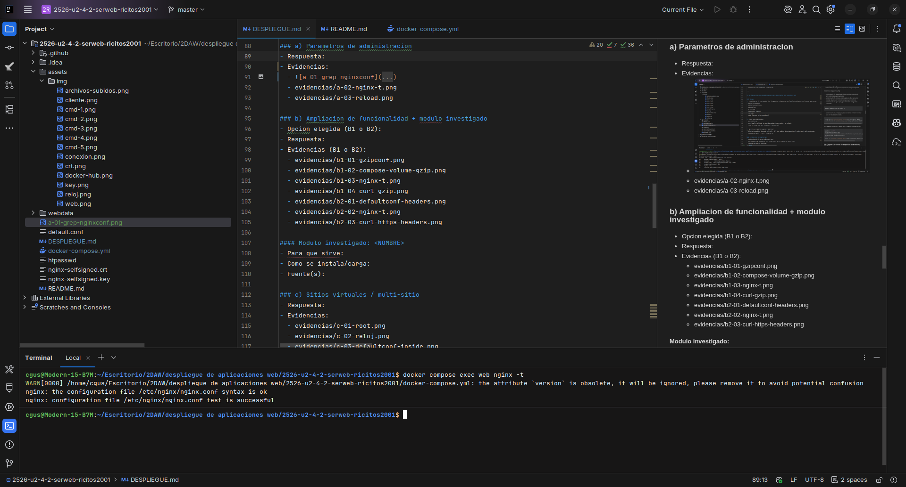 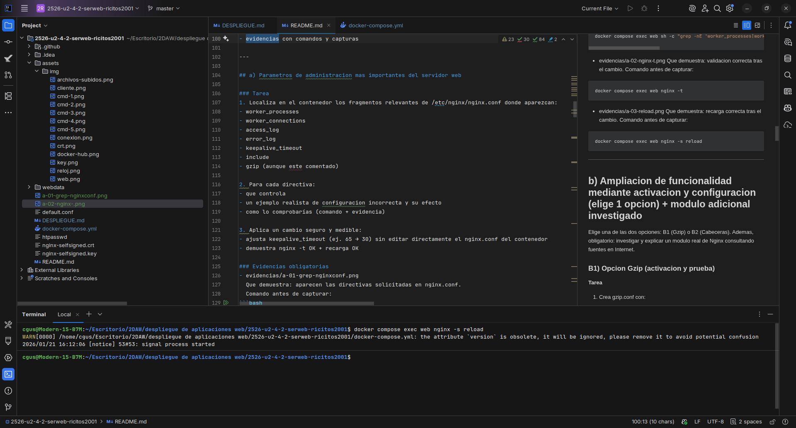

### b) Ampliacion de funcionalidad + modulo investigado
- Opcion elegida (B1 o B2):
- Respuesta: Muestra como se ha ampliado la funcionalidad de Nginx utilizando los modulos Gzip y de cabeceras de seguridad. Se han configurado ambos modulos en el archivo de configuracion de Nginx para habilitar la compresion de respuestas HTTP y agregar cabeceras de seguridad a las respuestas del servidor. Se ha verificado la correcta configuracion y funcionamiento de ambos modulos mediante comandos de prueba y revisando las cabeceras HTTP en las respuestas del servidor.
- Evidencias (B1 y B2): 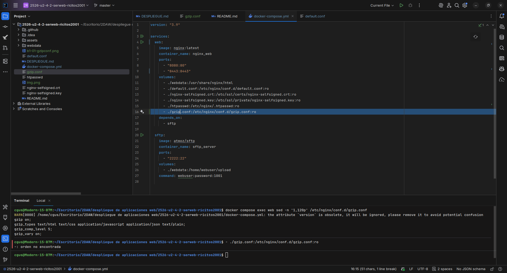 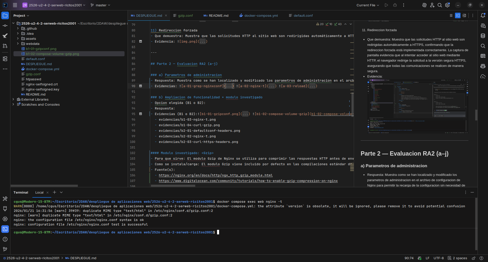 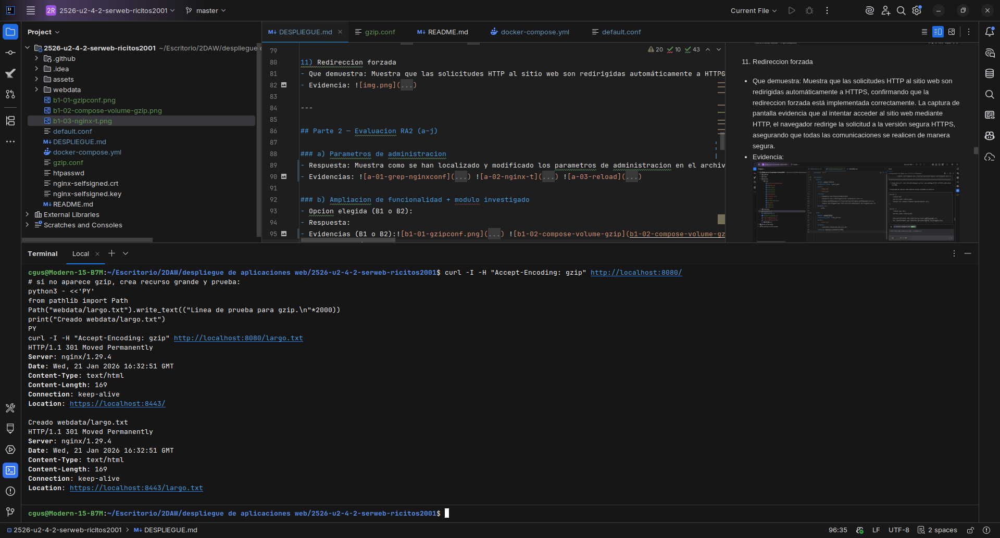   
#### Modulo investigado 1: <Gzip>
- Para que sirve: El modulo Gzip de Nginx se utiliza para comprimir las respuestas HTTP antes de enviarlas al cliente. Esto reduce el tamaño de los datos transferidos, lo que puede mejorar significativamente los tiempos de carga de las paginas web y reducir el uso del ancho de banda.
- Como se instala/carga: El modulo Gzip viene incluido por defecto en las compilaciones estándar de Nginx, por lo que no es necesario instalarlo por separado. Para habilitarlo, se deben agregar las directivas de configuracion relacionadas con Gzip en el archivo `nginx.conf` o en los archivos de configuracion de los sitios.
- Fuente(s): 
  - https://nginx.org/en/docs/http/ngx_http_gzip_module.html
  - https://www.digitalocean.com/community/tutorials/how-to-enable-gzip-compression-on-nginx

#### Modulo investigado 1: <Cabeceras de seguridad>
- Para que sirve: El modulo de cabeceras de seguridad en Nginx se utiliza para agregar cabeceras HTTP que mejoran la seguridad de las aplicaciones web. Estas cabeceras pueden ayudar a proteger contra diversas amenazas, como ataques de clickjacking, XSS (Cross-Site Scripting) y otros tipos de vulnerabilidades web.
- Como se instala/carga: Al igual que el modulo Gzip, las cabeceras de seguridad se configuran directamente en los archivos de configuracion de Nginx. No es necesario instalar un modulo adicional, sino que se agregan las directivas correspondientes en el bloque `server` o `location` del archivo de configuracion.
- Fuente(s):
  - https://developer.mozilla.org/en-US/docs/Web/HTTP/Headers
  - https://www.nginx.com/blog/mitigating-web-attacks-nginx-security-headers/

### c) Sitios virtuales / multi-sitio
- Respuesta:
- Evidencias:.png).png) 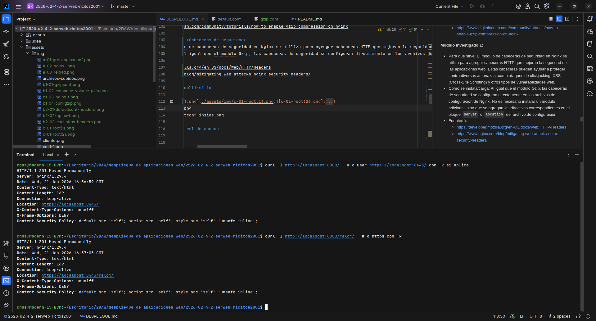 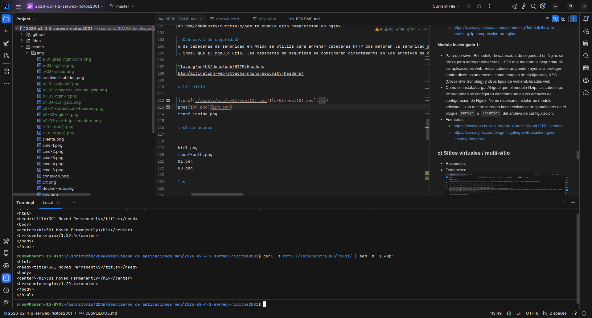

### d) Autenticacion y control de acceso
- Respuesta:
- Evidencias:
  - evidencias/d-01-admin-html.png
  - evidencias/d-02-defaultconf-auth.png
  - evidencias/d-03-curl-401.png
  - evidencias/d-04-curl-200.png

### e) Certificados digitales
- Respuesta:
- Evidencias:
  - evidencias/e-01-ls-certs.png
  - evidencias/e-02-compose-certs.png
  - evidencias/e-03-defaultconf-ssl.png

### f) Comunicaciones seguras
- Respuesta:
- Evidencias:
  - evidencias/f-01-https.png
  - evidencias/f-02-301-network.png

### g) Documentacion
- Respuesta:
- Evidencias: enlaces a todas las capturas

### h) Ajustes para implantacion de apps
- Respuesta:
- Evidencias:
  - evidencias/h-01-root.png
  - evidencias/h-02-reloj.png

### i) Virtualizacion en despliegue
- Respuesta:
- Evidencias:
  - evidencias/i-01-compose-ps.png

### j) Logs: monitorizacion y analisis
- Respuesta:
- Evidencias:
  - evidencias/j-01-logs-follow.png
  - evidencias/j-02-metricas.png

---

## Checklist final

### Parte 1
- [x] 1) Servicio Nginx activo
- [x] 2) Configuracion cargada
- [x] 3) Resolucion de nombres
- [x] 4) Contenido Web (Cloud Academy)
- [x] 5) Conexion SFTP exitosa
- [x] 6) Permisos de escritura
- [x] 7) Contenedores activos
- [x] 8) Persistencia (Volumen compartido)
- [x] 9) Despliegue multi-sitio (/reloj)
- [x] 10) Cifrado SSL
- [x] 11) Redireccion forzada (301)

### Parte 2 (RA2)
- [x] a) Parametros de administracion
- [x] b) Ampliacion de funcionalidad + modulo investigado
- [ ] c) Sitios virtuales / multi-sitio
- [ ] d) Autenticacion y control de acceso
- [ ] e) Certificados digitales
- [ ] f) Comunicaciones seguras
- [ ] g) Documentacion
- [ ] h) Ajustes para implantacion de apps
- [ ] i) Virtualizacion en despliegue
- [ ] j) Logs: monitorizacion y analisis
