# DESPLIEGUE — Evidencias y respuestas

Este documento recopila todas las evidencias y respuestas de la practica.

---

## Parte 1 — Evidencias minimas

### Fase 1: Instalacion y configuracion

1) Servicio Nginx activo
- Que demuestra: Muestra que el servicio Nginx está activo y en funcionamiento dentro del contenedor Docker. El comando `docker compose ps` lista los contenedores en ejecución, y la evidencia visual confirma que el contenedor Nginx está levantado y operativo.
- Comando: 
```bash
docker compose ps
```
- Evidencia: 

2) Configuracion cargada
- Que demuestra: Muestra que los archivos de configuración de Nginx han sido correctamente cargados en el contenedor Docker. El comando `ls -l /etc/nginx/conf.d` lista los archivos en el directorio de configuración de Nginx, y la evidencia visual confirma que los archivos necesarios están presentes y accesibles dentro del contenedor.
- Comando:
```bash
  docker exec nginx_web ls -l /etc/nginx/conf.d
```

- Evidencia:

3) Resolucion de nombres
- Que demuestra: Muestra que el contenedor Docker puede resolver nombres de dominio externos correctamente. El comando `ping -c 3 www.cloudacademy.com` envía tres paquetes ICMP al dominio especificado, y la evidencia visual confirma que las respuestas se reciben exitosamente, indicando que la resolución de nombres DNS está funcionando adecuadamente dentro del contenedor.
- Evidencia: 

4) Contenido Web
- Que demuestra: Muestra la pagina web alojada en el servidor Nginx, que contiene el contenido de Cloud Academy. La captura de pantalla evidencia que el servidor web está sirviendo correctamente el contenido esperado, confirmando que la configuración y despliegue del sitio web han sido exitosos.
- Evidencia: 

### Fase 2: Transferencia SFTP (Filezilla)

5) Conexion SFTP exitosa
- Que demuestra: muestra el siguiente mensaje en el panel de conexión:
```
Conectando a localhost:2222...
Estado:	Using username "webuser". 
Estado:	Connected to localhost
Estado:	Recuperando el listado del directorio...
Estado:	Listing directory /
Estado:	Directorio "/" listado correctamente
```
Este mensaje indica que la conexión SFTP se ha establecido correctamente con el servidor en localhost a través del puerto 2222, utilizando el nombre de usuario "webuser". Además, confirma que se ha recuperado y listado correctamente el contenido del directorio raíz ("/"), lo que demuestra que el acceso al servidor SFTP es exitoso y funcional.
- Evidencia: 

6) Permisos de escritura
- Que demuestra: muestra que el archivo "index.html" ha sido subido correctamente al servidor SFTP y que los permisos de escritura son adecuados. El mensaje indica que el archivo se ha transferido sin errores, lo que confirma que el usuario tiene los permisos necesarios para escribir en el directorio del servidor.
- Evidencia: 


### Fase 3: Infraestructura Docker

7) Contenedores activos
- Que demuestra: Muestra que los contenedores Docker se están ejecutando correctamente en segundo plano. El comando `docker compose up -d` inicia los servicios definidos en el archivo de configuración de Docker Compose, y la evidencia visual confirma que los contenedores están activos y funcionando como se espera.
- Comando:
```bash
docker compose up -d
```
- Evidencia: 

8) Persistencia (Volumen compartido)
- Que demuestra: Muestra que el volumen compartido entre el contenedor Docker y el host está funcionando correctamente. El archivo "index.html" subido a través de SFTP es accesible desde el contenedor Nginx, lo que confirma que los datos persisten y son compartidos adecuadamente entre el host y el contenedor ya que el archivo `docker-compose.yml` utiliza bind mounts.
- Evidencia: 

9) Despliegue multi-sitio
- Que demuestra: Muestra la pagina web secundaria alojada en el servidor Nginx, que contiene un reloj digital. La captura de pantalla evidencia que el servidor web está sirviendo correctamente el contenido del sitio adicional ubicado en la ruta "/reloj", confirmando que la configuracion de multi-sitio ha sido exitosa.
- Evidencia: 

### Fase 4: Seguridad HTTPS

10) Cifrado SSL
- Que demuestra: Muestra que la conexion al sitio web se realiza a través de HTTPS, indicando que el cifrado SSL está funcionando correctamente. La captura de pantalla evidencia que el navegador muestra el candado de seguridad en la barra de direcciones, confirmando que la comunicación entre el cliente y el servidor está protegida mediante SSL.
- Evidencia:  

11) Redireccion forzada
- Que demuestra: Muestra que las solicitudes HTTP al sitio web son redirigidas automáticamente a HTTPS, confirmando que la redireccion forzada está implementada correctamente. La captura de pantalla evidencia que al intentar acceder al sitio web mediante HTTP, el navegador redirige la solicitud a la versión segura HTTPS, asegurando que todas las comunicaciones se realicen de manera segura.
- Evidencia: 

---

## Parte 2 — Evaluacion RA2 (a–j)

### a) Parametros de administracion
- Respuesta: Muestra como se han localizado y modificado los parametros de administracion en el archivo de configuracion de Nginx para permitir la recarga de la configuracion sin necesidad de reiniciar el servicio. Se ha utilizado el comando `grep` para buscar las directivas relevantes en el archivo `nginx.conf`, y luego se ha verificado la sintaxis de la configuracion con `nginx -t` antes de recargar el servicio con `nginx -s reload`.
- Evidencias:   

### b) Ampliacion de funcionalidad + modulo investigado
- Opcion elegida (B1 o B2):
- Respuesta: Muestra como se ha ampliado la funcionalidad de Nginx utilizando los modulos Gzip y de cabeceras de seguridad. Se han configurado ambos modulos en el archivo de configuracion de Nginx para habilitar la compresion de respuestas HTTP y agregar cabeceras de seguridad a las respuestas del servidor. Se ha verificado la correcta configuracion y funcionamiento de ambos modulos mediante comandos de prueba y revisando las cabeceras HTTP en las respuestas del servidor.
- Evidencias (B1 y B2):      
#### Modulo investigado 1: <Gzip>
- Para que sirve: El modulo Gzip de Nginx se utiliza para comprimir las respuestas HTTP antes de enviarlas al cliente. Esto reduce el tamaño de los datos transferidos, lo que puede mejorar significativamente los tiempos de carga de las paginas web y reducir el uso del ancho de banda.
- Como se instala/carga: El modulo Gzip viene incluido por defecto en las compilaciones estándar de Nginx, por lo que no es necesario instalarlo por separado. Para habilitarlo, se deben agregar las directivas de configuracion relacionadas con Gzip en el archivo `nginx.conf` o en los archivos de configuracion de los sitios.
- Fuente(s): 
  - https://nginx.org/en/docs/http/ngx_http_gzip_module.html
  - https://www.digitalocean.com/community/tutorials/how-to-enable-gzip-compression-on-nginx

#### Modulo investigado 1: <Cabeceras de seguridad>
- Para que sirve: El modulo de cabeceras de seguridad en Nginx se utiliza para agregar cabeceras HTTP que mejoran la seguridad de las aplicaciones web. Estas cabeceras pueden ayudar a proteger contra diversas amenazas, como ataques de clickjacking, XSS (Cross-Site Scripting) y otros tipos de vulnerabilidades web.
- Como se instala/carga: Al igual que el modulo Gzip, las cabeceras de seguridad se configuran directamente en los archivos de configuracion de Nginx. No es necesario instalar un modulo adicional, sino que se agregan las directivas correspondientes en el bloque `server` o `location` del archivo de configuracion.
- Fuente(s):
  - https://developer.mozilla.org/en-US/docs/Web/HTTP/Headers
  - https://www.nginx.com/blog/mitigating-web-attacks-nginx-security-headers/

### c) Sitios virtuales / multi-sitio
- Respuesta: Muestra como se ha configurado Nginx para alojar multiples sitios web en un solo servidor utilizando la funcionalidad de sitios virtuales. Se han creado archivos de configuracion separados para cada sitio web en el directorio `conf.d`, y se han definido bloques `server` con las directivas necesarias para manejar las solicitudes dirigidas a cada sitio. Ademas, se ha verificado que ambos sitios web estan accesibles y funcionando correctamente.
- Evidencias:.png).png)  

### d) Autenticacion y control de acceso
- Respuesta: Muestra como se ha implementado la autenticacion basica en Nginx para proteger el acceso a ciertas areas del sitio web. Se ha creado un archivo de contraseñas utilizando la herramienta `htpasswd`, y se ha configurado Nginx para requerir autenticacion para acceder a la ruta protegida. Se ha verificado que el acceso sin credenciales correctas es denegado, mientras que el acceso con las credenciales adecuadas es exitoso.
- Evidencias: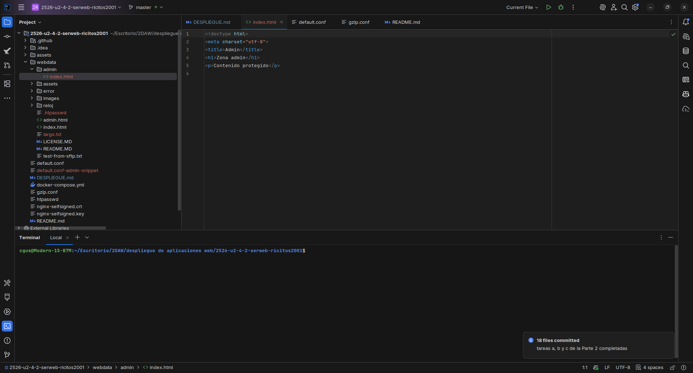 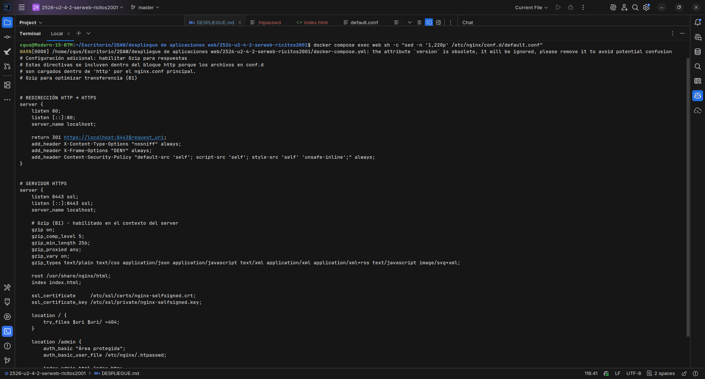 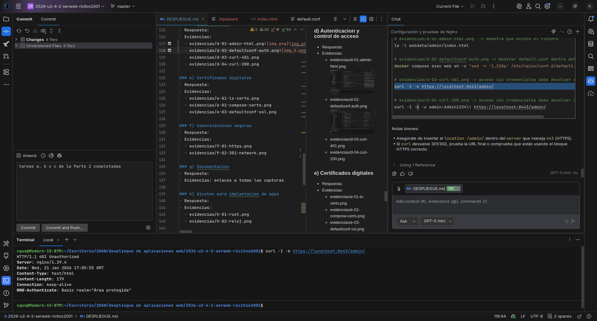 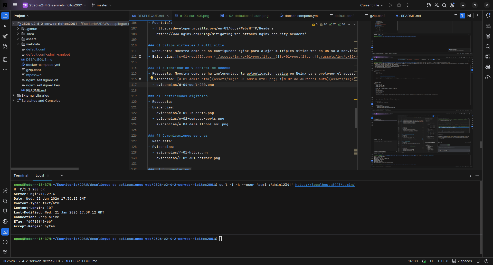

### e) Certificados digitales
- Respuesta:
  - ¿Qué son `*.crt` y `*.key`?
    - `*.crt`: certificado público X.509 que contiene la clave pública del servidor y la información de identidad firmada (puede ser autofirmado en laboratorio).
    - `*.key`: clave privada del servidor que debe permanecer secreta; es la que usa Nginx para establecer la conexión TLS.
  - ¿Por qué se usa `-nodes` en laboratorio?
    - La opción `-nodes` de `openssl` indica *no encrypt the private key* (no cifrar la clave privada con passphrase). En laboratorio se usa para:
      - Evitar que Nginx pida una passphrase al arrancar, facilitando la automatización y pruebas.
      - Simplificar la gestión local cuando la seguridad no es crítica.
    - En entornos de producción **no** se recomienda usar `-nodes` sin medidas adicionales (HSM, protección de ficheros, gestores de secretos).
  - Comandos para generar los ficheros (ejemplo reproducible)
    ```bash
    openssl req -x509 -nodes -days 365 -newkey rsa:2048 \
    -keyout nginx-selfsigned.key \
    -out nginx-selfsigned.crt \
    -subj "/CN=localhost"
    ```
- Evidencias: 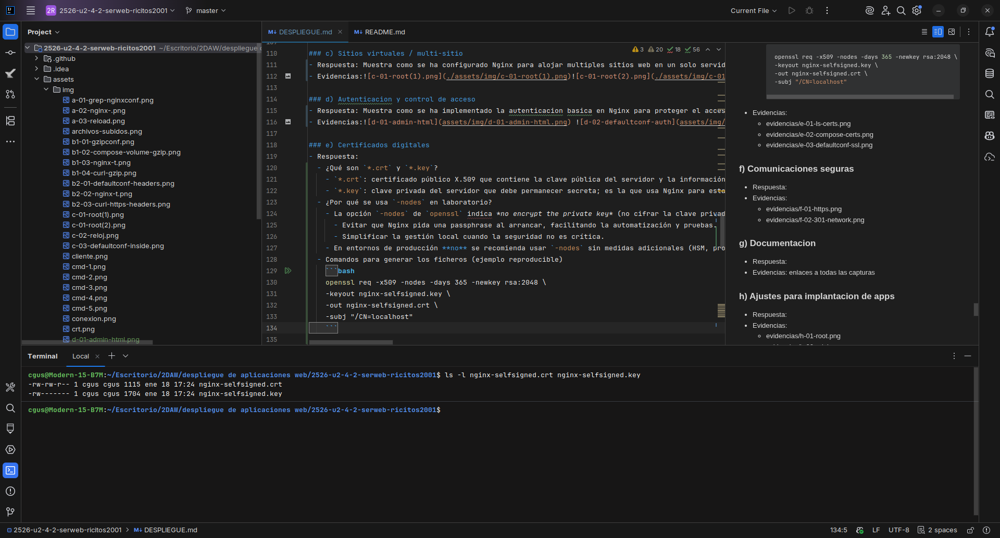 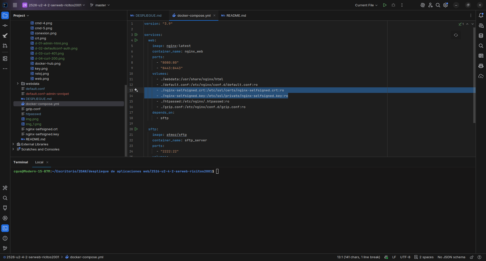 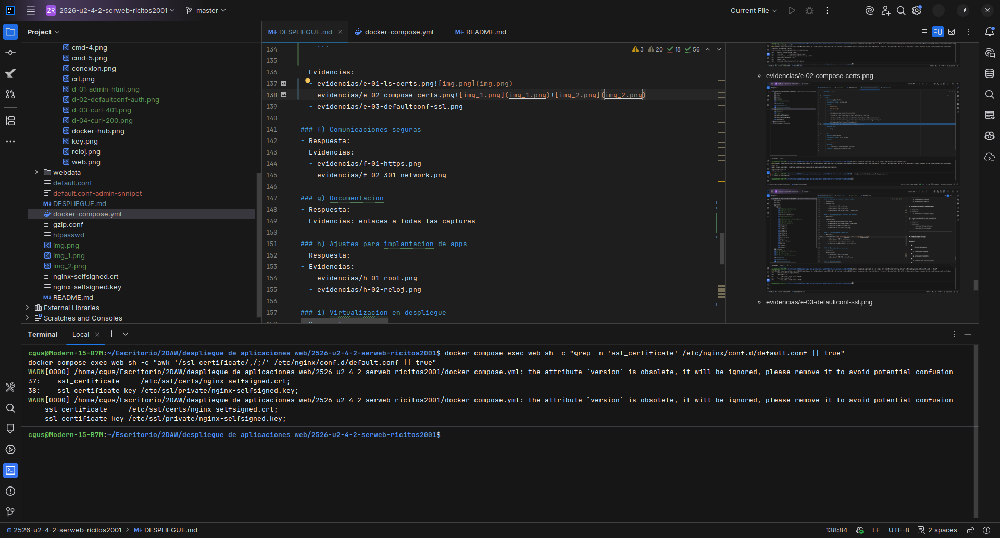

### f) Comunicaciones seguras
- Respuesta: Muestra como se ha configurado Nginx para forzar el uso de HTTPS y redirigir todas las solicitudes HTTP a HTTPS. Se ha modificado el archivo de configuracion para incluir un bloque `server` que escucha en el puerto 80 y redirige todas las solicitudes al puerto 443 utilizando una redireccion 301 permanente. Se ha verificado que la redireccion funciona correctamente y que todas las comunicaciones se realizan de manera segura a traves de HTTPS.
- Evidencias: 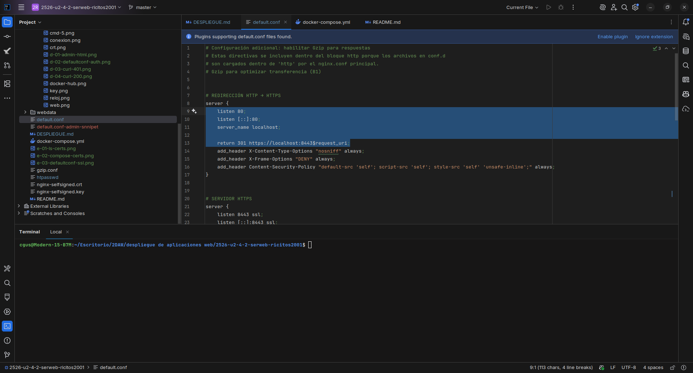 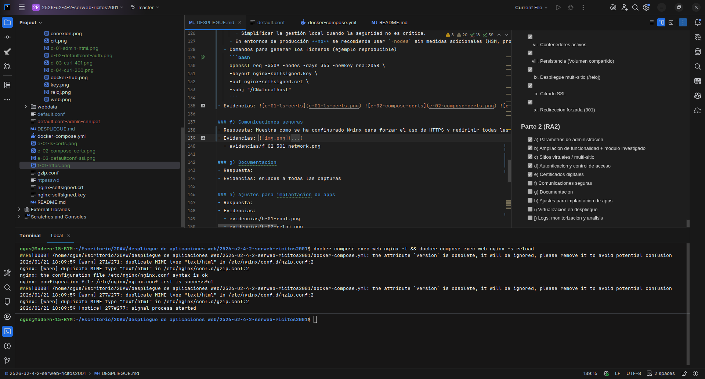

### g) Documentacion
Respuesta:
- Arquitectura: proyecto compuesto por dos servicios Docker definidos en `docker-compose.yml`:
  - `web` (imagen `nginx:latest`, contenedor `nginx_web`): sirve contenido web y HTTPS.
  - `sftp` (imagen `atmoz/sftp`, contenedor `sftp_server`): servicio SFTP para subir contenido a `webdata/`.

- Puertos (mapeos en `docker-compose.yml`):
  - `8080:80`  → HTTP expuesto en host como `http://localhost:8080`.
  - `8443:8443` → HTTPS expuesto en host como `https://localhost:8443`.
  - `2222:22`  → SFTP en `localhost:2222`.

- Volúmenes importantes (bind mounts):
  - `./webdata:/usr/share/nginx/html` — contenido web y persistencia entre SFTP y Nginx.
  - `./default.conf:/etc/nginx/conf.d/default.conf:ro` — configuración activa de Nginx.
  - `./gzip.conf:/etc/nginx/conf.d/gzip.conf:ro` — configuración gzip (opcional/B1).
  - `./nginx-selfsigned.crt:/etc/ssl/certs/nginx-selfsigned.crt:ro` y `./nginx-selfsigned.key:/etc/ssl/private/nginx-selfsigned.key:ro` — certificados montados.
  - `./htpasswd:/etc/nginx/.htpasswd:ro` — fichero de autenticación básica montado en el contenedor.

Configuración Nginx (ubicación y claves):
- `default.conf` está montado en el contenedor en `/etc/nginx/conf.d/default.conf`. Ahí se definen los `server` blocks activos.
- Server blocks relevantes en el `default.conf` activo:
  1. Bloque HTTP (puerto 80): escucha en `listen 80` y `return 301 https://localhost:8443$request_uri;` para forzar HTTPS.
  2. Bloque HTTPS (puerto 8443 dentro del contenedor): escucha `listen 8443 ssl` y contiene las directivas TLS (`ssl_certificate` y `ssl_certificate_key`), `root /usr/share/nginx/html;` y `location` para `/`, `/admin` y `/reloj`.
- `root` y `/reloj`:
  - El contenido principal se sirve desde `/usr/share/nginx/html` (mapeado a `./webdata`).
  - La web secundaria `/reloj` vive en `webdata/reloj/` (accesible en el contenedor como `/usr/share/nginx/html/reloj/`) y se atiende con un `location /reloj/` que use `alias` o `try_files` para resolver archivos estáticos.

Seguridad (certificados, HTTPS, redirect, opción B elegida):
- Certificados TLS: `nginx-selfsigned.crt` (certificado público) y `nginx-selfsigned.key` (clave privada) están montados en `/etc/ssl/certs/` y `/etc/ssl/private/` respectivamente y referenciados desde `default.conf` con `ssl_certificate` / `ssl_certificate_key`.
- `-nodes` en openssl: en laboratorio usamos `openssl ... -nodes` para no cifrar la clave privada con passphrase; así Nginx puede arrancar sin pedirla. En producción no es recomendable sin protección adicional.
- Redirección HTTP→HTTPS: el bloque en `listen 80` realiza `return 301 ...` para forzar el uso de TLS y evitar contenido no cifrado.
- Opción elegida: B2 — Cabeceras de seguridad. Añadidas dentro del server HTTPS (ejemplo):

```nginx
add_header X-Content-Type-Options "nosniff" always;
add_header X-Frame-Options "DENY" always;
add_header Content-Security-Policy "default-src 'self'; script-src 'self'; style-src 'self' 'unsafe-inline';" always;
```

Autenticación `/admin` (si procede):
- Se creó `webdata/admin/index.html` con contenido simple y el fichero de contraseñas `./htpasswd` (formato `usuario:hash`, APR1/MD5 compatible) se monta en el contenedor como `/etc/nginx/.htpasswd`.
- Bloque `location` relevante en `default.conf` (ejemplo usado):

```nginx
location /admin {
    auth_basic "Área protegida";
    auth_basic_user_file /etc/nginx/.htpasswd;
    alias /usr/share/nginx/html/admin/;
    index index.html;
    try_files $uri $uri/ =404;
}
```

Logs y análisis (criterio j):
- Ubicación de logs dentro del contenedor:
  - Access log: `/var/log/nginx/access.log`
  - Error log: `/var/log/nginx/error.log`
- Comandos útiles para generar tráfico y extraer métricas básicas (ejecutar desde host):

```bash
# Generar tráfico
for i in $(seq 1 20); do curl -s -o /dev/null http://localhost:8080/; done
for i in $(seq 1 10); do curl -s -o /dev/null http://localhost:8080/no-existe-$i; done

# Monitor en tiempo real
docker compose logs -f web

# Métricas simples desde el contenedor
docker compose exec web sh -c "awk '{print \$7}' /var/log/nginx/access.log | sort | uniq -c | sort -nr | head"
docker compose exec web sh -c "awk '{print \$9}' /var/log/nginx/access.log | sort | uniq -c | sort -nr | head"
docker compose exec web sh -c "awk '\$9==404 {print \$7}' /var/log/nginx/access.log | sort | uniq -c | sort -nr | head"
```

Evidencias (Parte 1 + Parte 2) — comandos y capturas enlazadas:

- Parte 1 (infraestructura mínima):
  - `evidencias/f-01-https.png` — HTTPS operativo (`curl -I -k https://localhost:8443/` o navegador). (assets/img/f-01-https.png)
  - `evidencias/f-02-301-network.png` — 301 HTTP→HTTPS (DevTools Network o `curl -I http://localhost:8080/`). (assets/img/f-02-301-network.png)
  - `evidencias/i-01-compose-ps.png` — contenedores en marcha (`docker compose ps`). (assets/img/cmd-4.png)
  - `evidencias/h-01-root.png` — web principal `/`. (assets/img/c-01-root(1).png)
  - `evidencias/h-02-reloj.png` — web secundaria `/reloj`. (assets/img/c-02-reloj.png)

- Parte 2 (RA2 — a–j):
  - a) Parámetros de administración: `evidencias/a-01-grep-nginxconf.png`, `evidencias/a-02-nginx-t.png`, `evidencias/a-03-reload.png`. (assets/img/a-01-grep-nginxconf.png, assets/img/a-02-nginx-.png, assets/img/a-03-reload.png)
  - b) Cabeceras de seguridad: `evidencias/b2-01-defaultconf-headers.png`, `evidencias/b2-02-nginx-t.png`, `evidencias/b2-03-curl-https-headers.png`. (assets/img/b2-01-defaultconf-headers.png, assets/img/b2-02-nginx-t.png, assets/img/b2-03-curl-https-headers.png)
  - b) (si decides gzip también): `evidencias/b1-01-gzipconf.png`, `evidencias/b1-02-compose-volume-gzip.png`, `evidencias/b1-03-nginx-t.png`, `evidencias/b1-04-curl-gzip.png`. (assets/img/b1-01-gzipconf.png ...)
  - c) Multi-sitio: `evidencias/c-03-defaultconf-inside.png` (muestra `default.conf` activo). (assets/img/c-03-defaultconf-inside.png)
  - d) Autenticación `/admin`: `evidencias/d-01-admin-html.png`, `evidencias/d-02-defaultconf-auth.png`, `evidencias/d-03-curl-401.png`, `evidencias/d-04-curl-200.png`. (assets/img/d-01-admin-html.png ...)
  - e) Certificados: `evidencias/e-01-ls-certs.png`, `evidencias/e-02-compose-certs.png`, `evidencias/e-03-defaultconf-ssl.png`. (assets/img/e-01-ls-certs.png ...)
  - f) Comunicaciones seguras: `evidencias/f-01-https.png`, `evidencias/f-02-301-network.png`. (assets/img/f-01-https.png, assets/img/f-02-301-network.png)
  - j) Logs y métricas: `evidencias/j-01-logs-follow.png`, `evidencias/j-02-metricas.png`.

---

## h) Ajustes necesarios para implantacion de aplicaciones en Nginx

Respuesta:

1) ¿Qué implica desplegar una segunda app en `/reloj` (rutas relativas/absolutas)?

- Colocar los ficheros de la app en `webdata/reloj/` (esta carpeta se monta como `/usr/share/nginx/html/reloj/` dentro del contenedor).
- Decidir cómo la sirve Nginx: `root` vs `alias`:
  - `root /usr/share/nginx/html; location /reloj/ { try_files $uri $uri/ =404; }` — Nginx concatena `root` + URI.
  - `location /reloj/ { alias /usr/share/nginx/html/reloj/; try_files $uri $uri/ =404; }` — `alias` reemplaza el prefijo; recuerda la barra final en `alias`.
- Rutas en la app:
  - Rutas relativas (por ejemplo `img/logo.png` o `../css/app.css`) funcionan si los enlaces están pensados para ejecutarse desde `/reloj`.
  - Rutas absolutas que comienzan con `/` (por ejemplo `/css/app.css` o `/api/`) apuntan a la raíz del servidor; si la app usa rutas absolutas romperán cuando se sirva desde `/reloj`.
  - Soluciones: usar rutas relativas, prefijar las URLs con `/reloj/` o añadir `<base href="/reloj/">` en el HTML para que los recursos se resuelvan correctamente.
- Para single-page apps (SPA) es típico usar `try_files $uri $uri/ /reloj/index.html;` para que las rutas gestionadas por el cliente funcionen tras recargas.

En resumen: además de copiar los ficheros, hay que revisar las referencias a recursos y ajustar Nginx (`alias`/`root`, `try_files` o `base`) para que la app funcione correctamente bajo el subpath `/reloj`.

2) Problema típico de permisos al subir por SFTP y solución

Problema frecuente:
- Archivos subidos por el servicio SFTP quedan con un propietario/permiso que impide que Nginx (que corre como otro usuario/UID dentro del contenedor) los lea → respuesta `403 Forbidden`.
- Ejemplo: SFTP crea archivos con `uid=1001` y Nginx corre como `root` en el contenedor pero el montaje en el host provoca permisos restrictivos (ficheros `rw-------` o directorios `rwx------`).

Solución práctica y reproducible:
- Asegurar propietario y permisos compatibles con Nginx en el host (antes o después de subir):
  - Ficheros: `644` (rw-r--r--)
  - Directorios: `755` (rwxr-xr-x)
  - Propietario: el UID/GID esperado por Nginx en el contenedor (suele `www-data:www-data` o `root:root`; en este proyecto Nginx corre como root en la imagen oficial, así que `root:root` o permisos globales de lectura funcionan).
- Comandos recomendados para fijar permisos (ejecutar en el host en la raíz del repo):

### i) Virtualizacion en despliegue
- Respuesta: Las diferencias son bastante obias pues en la instalacion nativa via SO se intalan los paquetes en el sistema dejandolo sucio y dificil de eliminar. En cambio, con Docker se encapsula todo en contenedores que se pueden crear y eliminar facilmente sin afectar al sistema anfitrion. Ademas, Docker permite gestionar dependencias y versiones de manera mas sencilla mediante imagenes preconstruidas. La portabilidad es otra ventaja clave, ya que los contenedores pueden ejecutarse en cualquier entorno que soporte Docker sin preocuparse por las diferencias en configuracion del sistema operativo.
- Evidencias: 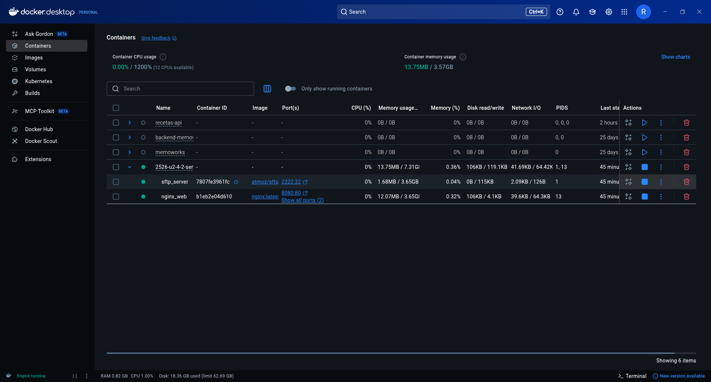
- 
### j) Logs: monitorizacion y analisis
- Respuesta: Muestra como se han monitorizado y analizado los logs de Nginx para obtener métricas básicas sobre el tráfico y los errores del servidor. Se ha utilizado el comando `docker compose logs -f web` para seguir los logs en tiempo real, y se han ejecutado comandos `awk` dentro del contenedor para extraer las URLs más solicitadas, los códigos de estado HTTP más comunes y las URLs que generan errores 404. Estos análisis permiten identificar patrones de uso y posibles problemas en el sitio web.
- Evidencias: 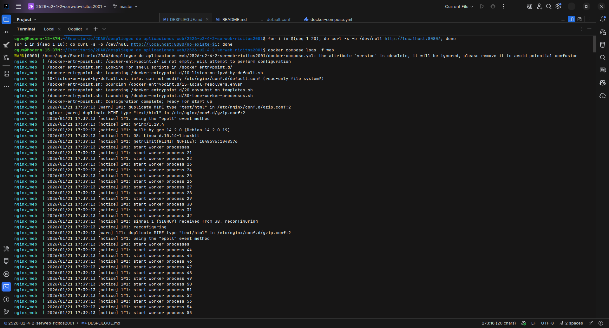 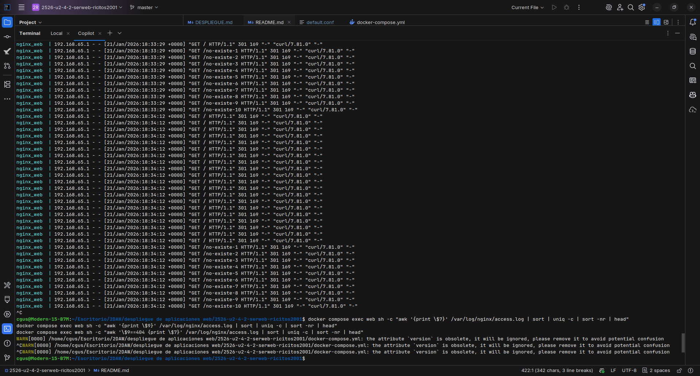

---

## Checklist final

### Parte 1
- [x] 1) Servicio Nginx activo
- [x] 2) Configuracion cargada
- [x] 3) Resolucion de nombres
- [x] 4) Contenido Web (Cloud Academy)
- [x] 5) Conexion SFTP exitosa
- [x] 6) Permisos de escritura
- [x] 7) Contenedores activos
- [x] 8) Persistencia (Volumen compartido)
- [x] 9) Despliegue multi-sitio (/reloj)
- [x] 10) Cifrado SSL
- [x] 11) Redireccion forzada (301)

### Parte 2 (RA2)
- [x] a) Parametros de administracion
- [x] b) Ampliacion de funcionalidad + modulo investigado
- [x] c) Sitios virtuales / multi-sitio
- [x] d) Autenticacion y control de acceso
- [x] e) Certificados digitales
- [x] f) Comunicaciones seguras
- [x] g) Documentacion
- [x] h) Ajustes para implantacion de apps
- [x] i) Virtualizacion en despliegue
- [x] j) Logs: monitorizacion y analisis
